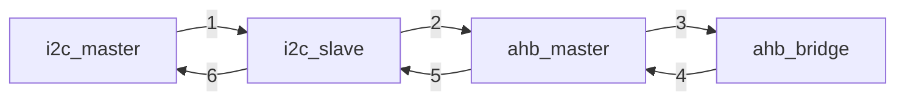

# i2c
## i2c
* verilog soft i2c_master 和 i2c_slave  
* slave的device id为`0x66`  
* i2c_slave 有一个存储器`reg [07:00] memery[15:00]`，用来存储数据
#### master进行读操作：  
  1. START
  2. device id+写命令  
  3. 要读取的ram地址
  4. device id+读命令
  5. 读数据
  6. STOP
```verilog
    /* i2c_master 读1byte数据代码 */
    IIC_READ0 + 0: begin
        flg_i2c <= START;
        data_i2c_w <= {7'h66, 1'b0};    // device address
    end
    IIC_READ0 + 1: begin
        flg_i2c <= WRITE;
        data_i2c_w <= 8'h00;            // read address
    end
    IIC_READ0 + 2: begin
        flg_i2c <= START;
        data_i2c_w <= {7'h66, 1'b1};    // device address
    end
    IIC_READ0 + 3: begin
        flg_i2c  <= READ;
        flg_nack <= 1'b1;
    end
```
#### master进行写操作：  
  1. START
  2. device id+写命令
  3. 要写入的ram地址
  4. 要写入的数据
  5. STOP
```verilog
    /* i2c_master 写1byte数据代码 */
    IIC_WRITE0 + 0: begin
        flg_i2c <= START;
        data_i2c_w <= {7'h66, 1'b0};  // device address & write
    end
    IIC_WRITE0 + 1: begin
        flg_i2c <= WRITE;
        data_i2c_w <= 8'h01;    //addr
    end
    IIC_WRITE0 + 2: data_i2c_w <= 8'ha5;  //data
    IIC_WRITE0 + 3: flg_i2c <= STOP;
```

#### 程序流程：
1. 对错误的device_id进行读取
2. 对正确的device_id进行读取
3. 写1byte数据
4. 读1byte数据
## i2c_ahbm  
* 带有ahb master的soft i2c_master 和 i2c_slave(基于之前的i2c)
* 对ahb的读写均由i2c_master进行操作，通过i2c_slave的储存器进行数据交换

#### 数据流向：  

写：i2c_master->i2c_slave->ahb_master->ahb_bridge (上图的1、2、3)  
读：写指令之后->ahb_bridge->i2c_slave->i2c_master  (上图的1、2、3、4、5、6)

#### i2c_slave储存器  
| ram地址  | 0x0-0x3 | 0x4-0x7 | 0x8-0xb | 0xc-0xf |
|------|------|------|------|------|
| 数据内容 | ahb写地址 | ahb写数据 | ahb读地址 | ahb读数据 |  
  
每次读/写后，地址会自动+1
### i2c_master操作  
要通过i2c_master读写ahb，需要向i2c_slave的ram中对应的数据地址写入数据；  
当对应的ram完整写入数据后,i2c_slave会自动向ahb读/写一次，若为读则将会将读出的数据放在ram中  
见下：
| 行为  | 功能 | 结果 |
|------|------|------|
| 向0x0-0x7连续写入8个8bit数据 | ahb写数据 | i2c_slave将0x0-0x3作为HWADDR,0x4-0x7作为HWDATA,作为AHB master写入一次 | 
| 向0x8-0xb连续写入4个8bit数据 | ahb读数据 | i2c_slave将0x8-0xb作为HRADDR,作为AHB master读取一次,并将读到的数据存在0xc-0xf中 | 
```
通过ahb写数据：
    1. 从0x0开始，连续写入8个8位数据
    2. slave检测到写完后，自动向ahb中写入一次  
通过ahb读数据:
    1. 从0x8开始，连续写入4个8位数据
    2. slave检测到写完后，自动从ahb对应地址读数据，并存入0xc-0xf的位置
    3. 从0xc-0xf读取数据
 ```
#### 程序流程：
1. 读取目标寄存器(此处为`0x03000018`)
2. 向目标寄存器写入数据
3. 再次读取寄存器，检测写入是否成功